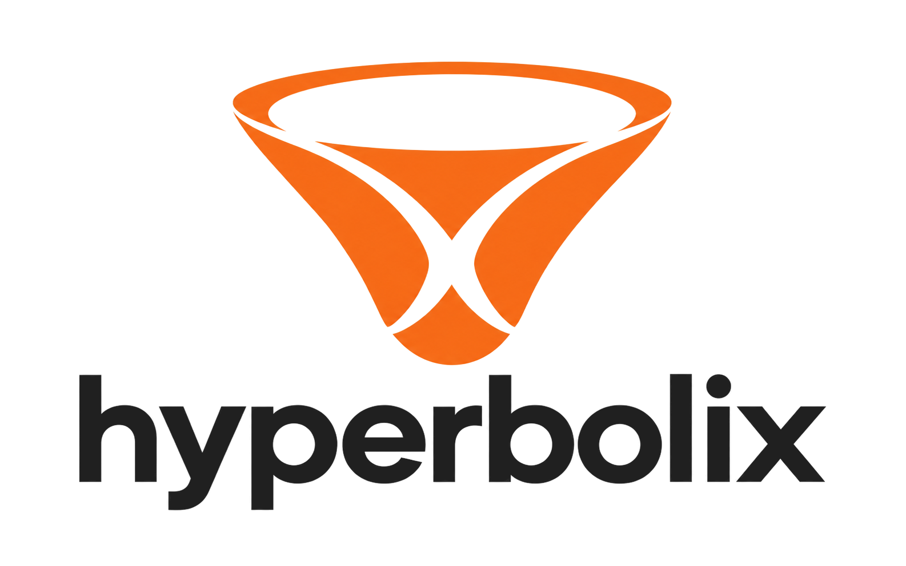

<p align="center">
  <picture>
    <source media="(prefers-color-scheme: dark)" srcset="docs/assets/hyperbolix-dark.png">
    <source media="(prefers-color-scheme: light)" srcset="docs/assets/hyperbolix-light.png">
    
  </picture>
</p>

<p align="center"><strong>Hyperbolic Deep Learning in JAX</strong></p>

<p align="center">
  <a href="https://github.com/timoklein/hyperbolix/actions/workflows/ci.yaml"></a>
  <a href="pyproject.toml"></a>
  <a href="https://jax.dev"></a>
  <a href="LICENSE"></a>
</p>

Pure JAX implementation of hyperbolic deep learning with manifold operations, neural network layers, and Riemannian optimizers. Built with Flax NNX and Optax.

## Features

- 🌐 **8 Manifolds**: Euclidean, Poincaré Ball, Hyperboloid, Proper Velocity, κ-Stereographic (signed curvature — hyperbolic, flat, and spherical in one manifold), Klein (Beltrami–Klein ball — straight-chord geodesics, Einstein gyrovector operations), Half-Space (Poincaré upper half-space — height as the last coordinate, Möbius gyrovector operations through the Cayley transform), and Product Manifold (mixed-curvature composition)
- 🎛️ **Learnable Curvature**: `LearnableCurvature` module bundles parameter + reparameterization (softplus, log/exp, or signed identity) + optional clamp. Works with any `nnx.Optimizer` — no Riemannian optimizer needed
- 🧠 **40+ Neural Network Layers**: Linear, convolutional, regression, attention, normalization, positional encoding, PV
- ⚡ **5 Hyperbolic Activations**: ReLU, Leaky ReLU, Tanh, Swish, GELU
- 📈 **Riemannian Optimizers**: RAdam and RSGD with automatic manifold detection
- 📊 **Wrapped Normal Distributions** and **Dimensionality Reduction** (HoroPCA, CO-SNE, Fréchet mean)
- 🚀 **Pure JAX/Flax NNX**: vmap-native API, JIT-compatible
- ✅ **7,000+ tests passing** (1,390 test functions, parametrized across dtypes, dimensions, manifolds) checked against independently transcribed NumPy/SciPy oracles

## Quick Start

```python
import jax
import jax.numpy as jnp
from flax import nnx
from hyperbolix.manifolds import Poincare
from hyperbolix.nn_layers import HypLinearPoincare

# Plain Python manifold class (optionally float64; pass `c=` for fixed curvature)
poincare = Poincare()  # dtype=jnp.float64 also needs jax.config.update("jax_enable_x64", True)

# Manifold operations (single-point; use jax.vmap for batches)
x = jnp.array([0.1, 0.2])
y = jnp.array([0.3, -0.1])
distance = poincare.dist(x, y, c=1.0)

# Neural network layer
layer = HypLinearPoincare(
    manifold_module=poincare,
    in_dim=128,
    out_dim=64,
    rngs=nnx.Rngs(0),
)
v_batch = 0.1 * jax.random.normal(jax.random.PRNGKey(0), (8, 128))
x_batch = jax.vmap(poincare.expmap_0, (0, None))(v_batch, 1.0)  # (8, 128) ball points
output = layer(x_batch, c=1.0)  # (8, 64)
```

### Mixed-Curvature Product Spaces

```python
from hyperbolix.manifolds import ProductManifold, Hyperboloid, Poincare, Euclidean

# H^5 × P^3 × E^4 — points live in R^12, each factor keeps its own curvature
product = ProductManifold(
    (Hyperboloid(c=1.0), 5),
    (Poincare(c=0.1), 3),
    (Euclidean(), 4),
)
cs = product.curvatures        # (1.0, 0.1, 0.0) — pass per-factor at call time
x = y = product.origin(cs)     # (12,) points
d = product.dist(x, y, cs)     # sqrt(sum d_i^2) over factors
```

To make any factor's curvature trainable, store one `LearnableCurvature`
instance per factor on your model and call it to obtain `c` for per-factor
operations (see "Learnable curvature" below).

## Installation

```bash
git clone https://github.com/timoklein/hyperbolix.git
cd hyperbolix
uv sync  # or: pip install -e .
```

**Requirements**: Python 3.12+, JAX 0.9+, Flax 0.12+, Optax 0.2.6+

## Documentation

📖 **[Full Documentation](https://timoklein.github.io/hyperbolix/)**

- **[Getting Started](docs/getting-started.md)** - Installation and first examples
- **[User Guides](docs/user-guide/)** - Manifolds, layers, optimizers, batching, numerical stability
- **[API Reference](docs/api-reference/)** - Complete API documentation
- **[Developer Guide](DEVELOPER_GUIDE.md)** - Development setup and workflows

Build docs locally: `uv run python scripts/vendor_mathjax.py` (once per checkout), then `uv run mkdocs serve`

## Key Concepts

**Plain-class manifolds, curvature passed at call time:** Each manifold is a plain Python class (not an `nnx.Module`) with automatic dtype casting; the curvature `c` is supplied per call so it can be static, dynamic, or a traced `jax.Array` driven by a learnable parameter on your model.

```python
from hyperbolix.manifolds import Poincare
poincare = Poincare()  # dtype=jnp.float64 also needs jax_enable_x64
dist = poincare.dist(x, y, c=1.0)  # (dim,) → scalar
```

**vmap-native API:** Methods operate on single points; use `jax.vmap` for batching.

```python
distances = jax.vmap(poincare.dist, in_axes=(0, 0, None))(
    x_batch, y_batch, 1.0
)
```

**Learnable curvature:** Use the `LearnableCurvature` module: one instance per distinct curvature in your model, called to obtain `c`. The manifold stays a plain Python class outside the NNX state, so one instance can be shared across layers and inside `nnx.scan` / `nnx.fori_loop`. The default `parameterization="log"` suits a `c` that may span orders of magnitude; `"softplus"` has a bounded gradient near zero; `"identity"` gives the signed curvature of `Stereographic`. `c` is clamped to `[init_c/10, init_c·10]` by default (`[0.1, 10]` at `init_c=1.0`; `[-10, 10]` for identity); pass `c_min=None, c_max=None` to disable.

```python
import optax
from flax import nnx
from hyperbolix import LearnableCurvature
from hyperbolix.manifolds import Hyperboloid
from hyperbolix.nn_layers import HypLinearHyperboloidPLFC

class Model(nnx.Module):
    def __init__(self, rngs):
        self.manifold = Hyperboloid(c=1.0)               # static, shared
        self.curvature = LearnableCurvature(init_c=1.0)  # one per distinct c
        self.fc = HypLinearHyperboloidPLFC(self.manifold, 33, 65, rngs=rngs)

    def __call__(self, x):
        c = self.curvature()                              # positive, clamped
        return self.fc(x, c=c)

model = Model(nnx.Rngs(0))

# Updated by any standard Euclidean optimizer — no Riemannian optimizer needed.
optimizer = nnx.Optimizer(model, optax.adam(1e-3), wrt=nnx.Param)
```

## Citation

```bibtex
@software{hyperbolix2026,
  title = {Hyperbolix: Hyperbolic Deep Learning in JAX},
  author = {Klein, Timo and Lang, Thomas},
  year = {2026},
  url = {https://github.com/timoklein/hyperbolix}
}
```

## References

Implements methods from:

- Ganea et al. (2018): Hyperbolic Neural Networks
- Bécigneul & Ganea (2019): Riemannian Adaptive Optimization
- Gu et al. (2019): Learning Mixed-Curvature Representations in Product Spaces
- Nagano et al. (2019): Wrapped Normal Distribution on Hyperbolic Space
- Bachmann et al. (2020): Constant Curvature Graph Convolutional Networks
- Shimizu et al. (2020): Hyperbolic Neural Networks++
- Chami et al. (2021): HoroPCA: Hyperbolic Dimensionality Reduction via Horospherical Projections
- Guo et al. (2022): CO-SNE: Dimensionality Reduction and Visualization for Hyperbolic Data
- Bdeir et al. (2023): Fully Hyperbolic CNNs
- Mao et al. (2024): Klein Model for Hyperbolic Neural Networks
- Bdeir et al. (2025): Robust Hyperbolic Learning
- Klis et al. (2026): Fast and Geometrically Grounded Lorentz Neural Networks
- Chen et al. (2026): Proper Velocity Neural Networks
- Zhang et al. (2026): Klein Hyperbolic Metric Learning

See individual module docstrings for detailed references.

## Contributing

Contributions welcome! See [DEVELOPER_GUIDE.md](DEVELOPER_GUIDE.md) for setup and guidelines.

For bugs or questions, [open an issue](https://github.com/timoklein/hyperbolix/issues).

## License

MIT License. See LICENSE for details.
